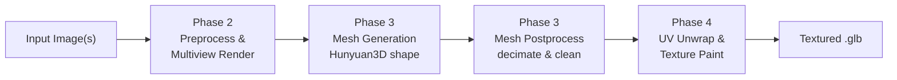

# 3d-pipeline

An end-to-end pipeline for generating textured 3D models from reference images using **Hunyuan3D-2.1**. The goal is to validate and benchmark a script that takes one or more photos of a subject and produces a clean, UV-unwrapped `.glb` mesh with painted textures. The pipeline is structured into four phases: multiview preprocessing, mesh generation, mesh postprocessing, and UV unwrap + texture painting.

## Pipeline



### Phase 2 — Preprocess & Multiview Render

Loads one or more input images and prepares them for the shape model. Background is removed via `rembg`, then two composites are produced: a **white-background** version for the shape DiT (which was trained on white-bg images) and a **gray-background** version as the paint reference (reduces directional lighting bias). If no real image is provided a synthetic RGBA image is generated for testing. Outputs `front_rgba.png`, `front_shape.png`, and `front_paint.png`.

### Phase 3 — Mesh Generation + Postprocess

Runs the **Hunyuan3D-2.1 shape pipeline** to generate a raw triangulated mesh from the preprocessed views. Supports single-image mode or multiview mode (up to 4 views). The raw mesh (~2 M faces) is then postprocessed: floaters (disconnected components) are removed, the mesh is normalized to a unit bounding box, and face count is decimated to a target of 200 k faces. Outputs `mesh_raw.glb` and `mesh_postprocessed.glb`.

### Phase 4 — UV Unwrap & Texture Paint

Takes the postprocessed mesh and produces a fully textured asset. Steps:

1. **UV unwrap** — `xatlas` unwraps the mesh into a single UV atlas
2. **Conditioning maps** — renders 6 normal and 6 position maps from fixed camera angles (front, right, back, left, top, bottom)
3. **Delighting** — removes lighting from the reference image so baked colour is albedo-only
4. **Multiview paint diffusion** — `MultiviewDiffusionNet` generates 6 albedo and 6 metallic-roughness views conditioned on the normal/position maps and the delighted reference
5. **Upscale & bake** — views are Lanczos-upscaled and back-projected onto the UV atlas

Outputs `mesh_uv.glb` plus the intermediate conditioning and albedo images.

## Setup

Requires Linux with CUDA 12.4 and a GPU with at least 8 GB VRAM (tested on a RunPod RTX 3090 pod).

```bash
bash setup.sh          # full install with interactive pre-flight check
bash setup.sh --yes    # skip confirmation prompts
```

The script runs 9 steps automatically:

| Step | What it does |
|------|--------------|
| 0 | Pre-flight resource check |
| 1 | System dependencies (Linux) |
| 2 | Install Miniconda into `./conda/` |
| 3 | Create conda env `hy3d-mv` (Python 3.10) |
| 4 | Install PyTorch with CUDA 12.4 |
| 5 | Install Python dependencies from `requirements.txt` |
| 6 | Clone third-party repos into `third_party/` |
| 7 | Build CUDA extensions |
| 8 | Download model weights via `scripts/download_models.py` |
| 9 | Verification checks |

To resume after a failure: `bash setup.sh --continue 4` (replace `4` with the step to restart from).

## Benchmark metrics

Measured on a RunPod **RTX 3090** pod (24 GB VRAM), multiview mode with 4 input views and 50 diffusion steps.

| Step | Time | Peak VRAM |
|------|------|-----------|
| Load shape pipeline | ~40 s | 4.8 GB |
| Generate mesh (4 views, 50 steps) | 118 s | 5.6 GB |
| Postprocess mesh (→ 200 k faces) | 46 s | 4.8 GB |
| UV unwrap | 41 s | — |
| **Phase 3 total** | **~207 s** | **5.6 GB** |
| **Phase 4 total (single-image)** | **~188 s** | **7.6 GB** |

Raw mesh output: ~2.1 M faces → decimated to 200 k faces after postprocessing. Single-image generation mode peaks at 7.63 GB VRAM.
