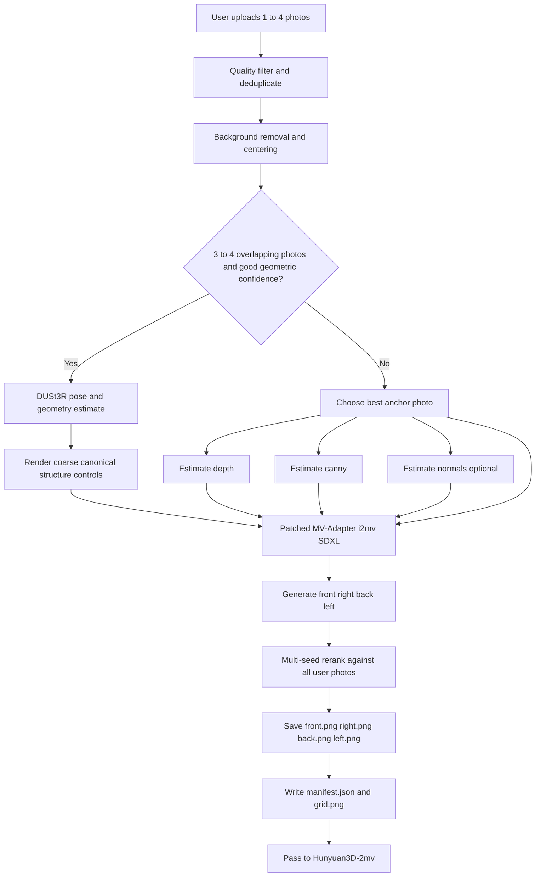

# Canonical Multiview Generation for Ship-Centric Image-to-3D Pipelines

## Executive summary

The best implementation path for your use case is **MV-Adapter image-to-multiview on SDXL**, extended into a **4-view canonical generator** for `front / right / back / left`, and augmented with **weak structural conditioning**: **depth first**, **canny second**, and **normal maps only as an optional third signal**. That recommendation is driven by fit, not novelty: MV-Adapter is already designed for multiview image synthesis at `768x768`, the official image-conditioned SDXL path already exists, the official model files include a **beta** image-to-multiview checkpoint, and the companion ComfyUI repo explicitly states that the beta checkpoint is better for selected-view generation, including the exact 4-view set `front & right & back & left`. Meanwhile, `tencent/Hunyuan3D-2mv` is already built to consume canonical multiview inputs for shape generation. citeturn36view0turn6view2turn37view0turn38search5turn5view3turn29view4

For **rigid but articulated ships**—especially cranes, booms, masts, deck rails, and stern/bow accessories—the most useful extra control is **depth**, because it stabilizes global structure without over-forcing texture edges. **Canny** helps, but should be used **weakly**, otherwise it can lock in background clutter, shadows, cables, or false edges from water reflections. **Normals** are valuable when you already have clean foreground crops and want better local deck/superstructure shape cues, but in SDXL the most practical route is not an official standalone normal checkpoint from the core collection; it is either a community all-in-one controller such as `xinsir/controlnet-union-sdxl-1.0`, or a separate refinement stage. citeturn23view0turn20view0turn25view0turn25view1turn20view3

For **one photo**, the production path should be: preprocess, remove background, center, estimate depth, optionally estimate normals, generate four canonical views with MV-Adapter, save a `manifest.json`, and pass those views into Hunyuan3D. For **three or four overlapping photos**, the best upgrade path is to add a **geometry-assisted branch** using DUSt3R, optionally followed by a NeRF or point-based rendering stage, because that path can preserve asymmetric deck equipment better than pure single-image diffusion. But that should be **phase two**, not phase one. citeturn35view1turn35view0turn28search1turn28search6

## Problem restatement

Your current weakness is not “3D generation quality” in isolation. It is **canonical view assignment**. `tencent/Hunyuan3D-2mv` expects multiview-controlled image inputs keyed as views such as `front`, `left`, `back`, and the official app code also exposes `front / back / left / right`. If those view semantics are wrong, the downstream 3D model inherits the wrong camera logic, and even a strong shape prior will bake in orientation mistakes. citeturn5view3turn15search0turn29view4

MV-Adapter is promising precisely because it converts a pretrained text-to-image backbone into a multiview generator, but the **official image-to-multiview SDXL script is still fundamentally single-anchor**: it takes one `reference_image`, one azimuth schedule, and generates a batch of views from that setup. That is a good base for canonical multiview generation, but it means that **1–4 arbitrary user photos** must be normalized into a canonicalization workflow before the 3D step rather than being fed through as if the user had already solved the viewpoint problem. citeturn9view0turn5view1

This is especially important for **marine ships with cranes/accessories** because the objects are only “mostly rigid.” The hull is rigid, but the discriminative identity cues often sit in **asymmetric articulated structures**: deck cranes, booms, bridge placement, helipad offsets, winches, lifeboats, radar masts, exhaust stacks, and stern machinery. Any front/back swap, left/right mirroring, or aggressive hallucination of occluded accessories will hurt shape fidelity much more than it would on a symmetric toy chair or mug. Similar viewpoint sensitivity is visible in other open pipelines: Consistent123 recommends a **single front-facing object** in a square crop, and Wonder3D explicitly notes that **front-facing** inputs and low-occlusion images work better, while also defining output views relative to the **input camera system**, not a universal canonical object frame. citeturn31view0turn17view1turn30view0

**Assumptions used in this report:** the source image resolution is unspecified; I assume arbitrary RGB photos that will be standardized into square foreground-centered inputs; no camera calibration is available; the immediate goal is a Python script that outputs canonical `front/right/back/left` images and a manifest suitable for handoff to `tencent/Hunyuan3D-2mv`. This assumption set is an engineering choice for implementation clarity.

## Solution landscape

### Option comparison

| Priority | Option | Fit for ship-like rigid/articulated objects | Main advantages | Main drawbacks | VRAM / latency from primary sources | Primary source basis |
|---|---|---|---|---|---|---|
| Highest | **MV-Adapter i2mv SDXL + 4-view beta checkpoint** | Best overall fit | Direct multiview image generator; official `768x768`; official image-conditioned SDXL path exists; beta checkpoint is explicitly reported as better for `front/right/back/left` selection | Upstream i2mv path is still single-reference; canonicalization logic around 1–4 user photos must be added by you | Official repo says image-to-multiview has the highest requirements at about **14G GPU memory**; medium latency | citeturn36view0turn6view2turn9view0turn37view0turn38search5 |
| Highest | **MV-Adapter i2mv SDXL + patched ControlNet depth/canny** | Best structural upgrade to the first option | Keeps MV-Adapter’s multiview prior while adding spatial structural control; Diffusers SDXL ControlNet supports one or multiple ControlNets; depth and canny SDXL checkpoints are well documented | Requires a local fork because the official i2mv SDXL pipeline does **not** expose the optional `controlnet_image` branch that exists in the t2mv SDXL path | Official docs do not publish a single minimum VRAM for this exact hybrid; expect more than the 14G baseline | citeturn12view0turn14view0turn13view3turn39view0turn39view2turn23view0turn20view0 |
| High | **SV3D** | Good for orbit-like canonical sampling | Designed for high-resolution image-to-multi-view orbital video; official `SV3D_p` accepts camera paths via azimuth/elevation lists; easy to extract four canonical frames from a 21-frame orbit | Produces an orbit video, not a direct 4-view still set; official release emphasizes white-background single-object usage; official minimum VRAM is not clearly stated | Official release: **21 frames** at **576x576**; latency and VRAM not explicitly specified in the release notes | citeturn17view2turn17view3 |
| High when 3–4 photos overlap well | **DUSt3R + NeRF / point-cloud render** | Strongest fidelity path when multiple user photos overlap | Recovers 3D points, focal lengths, poses, and confidence from arbitrary image collections; can preserve asymmetry better than single-image diffusion; good phase-two path for ships with cranes | More engineering; overlap-dependent; not ideal for the one-photo case; slower end-to-end than direct multiview diffusion | DUSt3R provides checkpoints and demo code; COLMAP/instant-ngp style pipelines require a GPU but do not declare one neat shared minimum in official docs | citeturn35view1turn35view0turn28search1turn28search6turn28search0 |
| Medium | **Hunyuan3D-2mv direct multiview handoff** | Excellent downstream target, not the upstream fix | Native multiview image-to-shape path; official card uses keyed multiview dicts; app code exposes `front/back/left/right`; fast way to consume your canonical views after generation | It does **not** solve the canonical-view problem by itself; it assumes those views are already meaningful | Official repo provides fast/turbo/multiview variants, but no single explicit VRAM floor for the multiview branch in the docs cited here | citeturn5view3turn29view4turn15search0 |
| Medium-low | **Consistent123** | Weak fit as a canonical-view preprocessor | Useful research baseline; explicitly combines Zero-1-to-3 with depth/normal preprocessing | Front-facing square-object assumption; 3D reconstruction-oriented rather than clean canonical 4-view generation; older stack and more setup friction | No simple official minimum VRAM stated in repo snippets used here | citeturn17view1turn31view0turn31view2 |
| Medium-low | **Wonder3D** | Better as a full 2D-to-3D baseline than as a canonical front-end | Jointly generates multiview RGB and normals; official paper/repo emphasize consistent normal/color generation | Official repo says front-facing inputs work best, low occlusion helps, current implementation is low-resolution, and output views are defined in the input-view camera system rather than a shared canonical object frame | Official repo says reconstruction is **2–3 minutes** and current implementation generates limited **6 views** at **256x256** | citeturn30view0 |
| Medium-low | **One-2-3-45** | Good fast 3D baseline, not the cleanest canonicalizer | Forward-only image-to-3D pipeline; official project claims about 45 seconds | Built as a full 3D method, not as a canonical 4-view preprocessing layer; still inherits Zero123-style view synthesis logic | Official repo states **>=18GB** GPU memory required | citeturn33view0turn33view1 |

The critical conclusion is that **only MV-Adapter is already shaped like your immediate problem**: “take one reference image and synthesize a clean, consistent multiview set.” The other strong options are either **better downstream targets** such as `tencent/Hunyuan3D-2mv`, or **better phase-two geometry branches** such as DUSt3R plus rendering, or **full image-to-3D baselines** that are less convenient as canonical front-end stages. citeturn5view1turn35view1turn5view3turn30view0turn17view1

### Why MV-Adapter wins this specific problem

MV-Adapter’s architecture is specifically about adapting pretrained text-to-image models into multiview generators without rewriting the whole base network, and the official project page shows it working with text, image conditioning, geometry conditioning, and ControlNet-based sketches. The official model card also highlights arbitrary view generation and compatibility with SDXL, personalized models, and ControlNet. That is a much tighter fit to “canonical multiview synthesis before 3D generation” than methods whose main abstraction is “single image to final 3D mesh.” citeturn5view1turn36view0

A particularly useful detail for your case is the **4-view beta image checkpoint**. It is listed in the model files, and the companion ComfyUI nodes explicitly say that using `mvadapter_i2mv_sdxl_beta.safetensors` improves **2-view**, **3-view**, and especially **4-view** selected-view generation, naming the exact set `front & right & back & left`. That is unusually close to your target behavior and is more action-guiding than the paper abstract alone. citeturn37view0turn38search5turn38search0

## Recommended architecture

### Architecture choice

The recommended production architecture is a **two-path canonicalization system**:

1. A **default single-anchor path** that always works, even from one photo, and uses **MV-Adapter i2mv SDXL** with optional **depth / canny / normal** side controls.
2. A **geometry-assisted multi-photo path** that activates only when you receive **three or four overlapping photos** and DUSt3R succeeds with good confidence; that path estimates geometry/poses first, then either renders canonical controls or directly renders a coarse canonical point-based view for refinement. citeturn35view1turn35view0turn5view1turn9view0

The important implementation decision is that **v1 should ship only the default single-anchor path plus reranking with extra photos**. DUSt3R is valuable, but it is a second milestone because it adds another dependency stack, another confidence layer, and a pose/geometry branch that is unnecessary for your first reliable canonicalizer. citeturn35view0turn35view1

### Processing flow



This structure matches the upstream software reality. The official i2mv SDXL script already contains the **camera-conditioned multiview generator**, background removal hook, view scheduling via `azimuth_deg`, and reference-image conditioning. The one thing it does **not** include upstream is a generic i2mv ControlNet branch, so that is the only component I recommend forking locally. citeturn9view0turn13view3turn12view0turn14view0

### Preprocessing and control estimation

For foreground extraction, use **BiRefNet**, because the official MV-Adapter i2mv SDXL script already uses `ZhengPeng7/BiRefNet` when `--remove_bg` is enabled. That minimizes divergence from the upstream behavior. citeturn9view0turn5view6

For **depth**, use either **DPT/MiDaS** or **ZoeDepth** as the first working backend. That choice is practical for two reasons: Diffusers’ official SDXL depth ControlNet card demonstrates `Intel/dpt-hybrid-midas`, and the `xinsir/controlnet-depth-sdxl-1.0` card explicitly says it supports **Zoe** and **MiDaS** preprocessors. For ship objects, depth should be your first extra condition because it stabilizes hull silhouette, deck plane, bridge massing, and crane-to-deck relative placement. citeturn23view0turn21view2turn5view7turn5view8

For **normals**, the most defensible default is **Metric3Dv2** if you want a discriminative geometry model, with **GeoWizard** as a very strong alternative when your images are already foreground-focused and object-centric. Metric3Dv2 explicitly supports zero-shot metric depth and surface normal estimation and reports strong benchmark results; GeoWizard jointly predicts depth and normals and exposes an `object` domain for background-free objects. Marigold normals are also a reasonable optional backend because the normals model exists, it has a diffusers-friendly workflow, and its model card recommends an effective input scale around the base diffusion resolution. citeturn41view3turn18view0turn18view1turn18view2turn19view0

For **canny**, keep it weak and secondary. Use it mainly to stabilize hard silhouette details such as crane booms, bridge outlines, and handrail masses, but not to define the whole object. Official SDXL canny guidance examples recommend a `controlnet_conditioning_scale` around `0.5` for generalization; for ship canonicalization I would start lower than that because photographs of ships often contain busy rigging, container edges, water speculars, quay lines, and sky-horizon clutter that can overconstrain generation. citeturn20view0turn20view3

### View scheduling and settings

The official MV-Adapter i2mv SDXL script accepts user-facing `azimuth_deg` lists such as `[0, 45, 90, 180, 270, 315]` and internally maps them into camera controls. For your canonical four-view case, the correct public-facing schedule is simply **`[0, 90, 180, 270]`** mapped to **`front, right, back, left`**. Save those exact labels in the manifest, because Hunyuan’s multiview branch uses keyed dictionaries rather than just positional image batches. citeturn9view0turn15search0turn5view3

| Parameter | Recommendation | Why |
|---|---|---|
| Preprocess size | Normalize input long side to `1024–1536`, then center-pad to square | Preserve thin structures before resizing to the generator canvas |
| Generation size | `768 x 768` | MV-Adapter’s SDXL path is explicitly built for `768` multiview generation citeturn36view0turn5view1 |
| Depth control size | Compute at `1024`, then resize to `768` | Official SDXL depth ControlNet examples normalize toward `1024`; structural maps benefit from higher-resolution preprocessing citeturn23view0turn21view2 |
| Inference steps | `40–50` for quality, `8–12` only for preview | Official i2mv SDXL script defaults to `50`; LCM is provided as a low-step option, but quality is lower citeturn9view0turn5view0 |
| Guidance scale | Start at `3.0`; search `2.5–3.5` | `3.0` is the official i2mv SDXL default and is a good balance for object fidelity citeturn9view0 |
| Reference conditioning scale | Start at `1.0`; reduce to `0.8–0.9` if controls are strong | Official i2mv SDXL default is `1.0`; slightly lowering it can reduce over-copying from a bad anchor photo citeturn9view0 |
| MV camera control scale | Keep at `1.0` | This is how the official script calls the multiview control image citeturn9view0 |
| Depth control scale | Start `0.4–0.6` | Official SDXL depth card recommends `0.5` for generalization; ships benefit from moderate depth anchoring citeturn23view0 |
| Canny control scale | Start `0.15–0.30` | Use as a weak accessory-preserving signal rather than a dominant controller; this is an engineering recommendation grounded in the general SDXL canny guidance regime citeturn20view0 |
| Normal control scale | Start `0.20–0.40` | Useful when the foreground crop is clean; keep weaker than depth to avoid surface overfitting |
| Seeds | Fix one seed per batch, then rerun `3–5` seeds on hard cases | Multi-seed ensembles help resolve stern/bow and crane ambiguities |
| Canonical labels | `front=0`, `right=90`, `back=180`, `left=270` | Stable manifest semantics for Hunyuan handoff citeturn9view0turn15search0 |

### Control stacking recommendation

If you want the shortest path to a good v1, implement the following **strict priority order**:

**Depth only** → **Depth + weak canny** → **Depth + weak normal** → **Depth + weak canny + weak normal**.

That order is deliberate. The official SDXL ecosystem has the clearest and strongest primary documentation for **depth** and **canny**. Normal conditioning is absolutely worth exploring, but the cleanest SDXL normal path in your stack is more naturally a **community union/multi-condition controller** than a neatly documented first-party single-purpose normal checkpoint. citeturn23view0turn20view0turn25view0turn25view1

## Implementation specification

### Primary artifacts

The following artifacts are the most implementation-relevant primary sources for your build:

| Component | Recommended artifact | Code-friendly link | Why it matters |
|---|---|---|---|
| MV generation repo | `huanngzh/MV-Adapter` | [repo](https://github.com/huanngzh/MV-Adapter) | Upstream source for i2mv SDXL, scheduler setup, camera controls, and background-removal hook |
| MV weights | `huanngzh/mv-adapter` | [model card](https://huggingface.co/huanngzh/mv-adapter) | Official weights and checkpoint names |
| 4-view beta checkpoint | `mvadapter_i2mv_sdxl_beta.safetensors` | [file](https://huggingface.co/huanngzh/mv-adapter/blob/main/mvadapter_i2mv_sdxl_beta.safetensors) | Best official-adjacent artifact for selected canonical view generation |
| 3D target repo | `Tencent-Hunyuan/Hunyuan3D-2` | [repo](https://github.com/Tencent-Hunyuan/Hunyuan3D-2) | Downstream image-to-3D target |
| 3D multiview checkpoint | `tencent/Hunyuan3D-2mv` | [model card](https://huggingface.co/tencent/Hunyuan3D-2mv) | Native multiview shape generator |
| Base model | `stabilityai/stable-diffusion-xl-base-1.0` | [model card](https://huggingface.co/stabilityai/stable-diffusion-xl-base-1.0) | Base SDXL backbone used by MV-Adapter and SDXL ControlNet examples |
| VAE | `madebyollin/sdxl-vae-fp16-fix` | [model card](https://huggingface.co/madebyollin/sdxl-vae-fp16-fix) | Matches official MV-Adapter and SDXL ControlNet usage |
| Depth ControlNet | `diffusers/controlnet-depth-sdxl-1.0` | [model card](https://huggingface.co/diffusers/controlnet-depth-sdxl-1.0) | Most defensible first depth controller |
| Canny ControlNet | `diffusers/controlnet-canny-sdxl-1.0` | [model card](https://huggingface.co/diffusers/controlnet-canny-sdxl-1.0) | Most defensible first edge controller |
| Optional all-in-one control | `xinsir/controlnet-union-sdxl-1.0` | [model card](https://huggingface.co/xinsir/controlnet-union-sdxl-1.0) | Practical route for normals / multi-condition SDXL control |
| Background removal | `ZhengPeng7/BiRefNet` | [repo](https://github.com/ZhengPeng7/BiRefNet) | Official MV-Adapter script already uses it |
| Depth backends | `isl-org/ZoeDepth`, `isl-org/MiDaS` | [ZoeDepth](https://github.com/isl-org/ZoeDepth), [MiDaS](https://github.com/isl-org/MiDaS) | Strong preprocessing choices for depth control |
| Normal backends | `YvanYin/Metric3D`, `fuxiao0719/GeoWizard`, `prs-eth/marigold-normals-v1-1` | [Metric3D](https://github.com/YvanYin/Metric3D), [GeoWizard](https://github.com/fuxiao0719/GeoWizard), [Marigold normals](https://huggingface.co/prs-eth/marigold-normals-v1-1) | Three viable normal-estimation tracks |

The links above are all directly tied to primary repos or model cards. Their relevance is supported by the official MV-Adapter repo/model card, the Hunyuan3D repo/model card, the SDXL ControlNet docs and checkpoint cards, and the depth/normal model repos cited throughout this report. citeturn5view0turn36view0turn37view0turn38search5turn5view2turn5view3turn23view0turn20view0turn25view0turn9view0turn5view7turn5view8turn41view3turn18view0turn18view2

### Install commands

```bash
conda create -n shipcanon python=3.10 -y
conda activate shipcanon

# install PyTorch for your CUDA version
pip install torch torchvision --index-url https://download.pytorch.org/whl/cu121

# clone upstream repos
git clone https://github.com/huanngzh/MV-Adapter.git
git clone https://github.com/Tencent-Hunyuan/Hunyuan3D-2.git

# install MV-Adapter
pip install -r MV-Adapter/requirements.txt
pip install -e MV-Adapter

# install Hunyuan3D
pip install -r Hunyuan3D-2/requirements.txt
pip install -e Hunyuan3D-2

# extra packages for the canonicalizer script
pip install diffusers transformers accelerate safetensors \
    opencv-python pillow rembg controlnet-aux trimesh

# optional image geometry backends
pip install -r metric3d/requirements_v2.txt   # if you use Metric3D locally
```

The first half of the install sequence follows the official repo guidance for MV-Adapter and Hunyuan3D. I added editable installs and a few extra packages only because a unified local script is easier to maintain when both repos can be imported directly from one environment. If you also want Hunyuan texture generation, install its rasterizer submodules exactly as shown in the official repo. citeturn6view2turn29view0

### Script design

The cleanest v1 is a **single-file Python CLI** named `canonical_multiview.py`, even if you later split it into modules.

| Layer | Recommended file/function | Responsibility |
|---|---|---|
| CLI | `parse_args()` | Input images, prompt, enable/disable controls, checkpoint ids, seed, output path |
| Preprocess | `load_and_rank_inputs()`, `remove_bg()`, `center_pad_resize()` | Choose anchor image; background removal; centering; square canvas |
| Controls | `build_depth_map()`, `build_canny_map()`, `build_normal_map()` | Generate structural control images |
| MV camera control | `build_plucker_control_images()` | Create the MV-Adapter camera-condition input |
| MV pipeline | `load_mvadapter_pipe()` | Load SDXL base, VAE, MV-Adapter checkpoint, optional ControlNet(s) |
| Generation | `generate_canonical_views()` | Emit front/right/back/left |
| Selection | `rerank_candidates()` | Multi-seed or multi-anchor scoring against extra user photos |
| Export | `save_views()`, `save_grid()`, `save_manifest()` | Persist images plus metadata |
| 3D handoff | `run_hunyuan_mv()` | Feed canonical views into `tencent/Hunyuan3D-2mv` |

### CLI contract

A practical v1 CLI looks like this:

```text
python canonical_multiview.py \
  --input_dir ./inputs/ship_case_01 \
  --prompt "offshore crane vessel, industrial ship, clean studio background" \
  --output_dir ./runs/ship_case_01 \
  --mv_adapter_checkpoint mvadapter_i2mv_sdxl_beta.safetensors \
  --gen_size 768 \
  --steps 50 \
  --guidance_scale 3.0 \
  --reference_conditioning_scale 1.0 \
  --use_depth \
  --use_canny \
  --depth_backend dpt \
  --normal_backend none \
  --depth_scale 0.5 \
  --canny_scale 0.2 \
  --seed 7 \
  --run_hunyuan
```

### Data layout and manifest

Use this directory structure:

```text
runs/ship_case_01/
  inputs/
    user_00.png
    user_01.png
  preproc/
    anchor.png
    anchor_rgba.png
    depth.png
    canny.png
    normal.png
  outputs/
    front.png
    right.png
    back.png
    left.png
    grid.png
  manifest.json
  mesh.glb
```

A good `manifest.json` schema is:

```json
{
  "input_files": ["inputs/user_00.png", "inputs/user_01.png"],
  "anchor_file": "preproc/anchor.png",
  "prompt": "offshore crane vessel, industrial ship, clean studio background",
  "seed": 7,
  "generation": {
    "size": 768,
    "steps": 50,
    "guidance_scale": 3.0,
    "reference_conditioning_scale": 1.0
  },
  "controls": {
    "depth": "preproc/depth.png",
    "canny": "preproc/canny.png",
    "normal": null,
    "depth_scale": 0.5,
    "canny_scale": 0.2,
    "normal_scale": 0.0
  },
  "views": [
    {"name": "front", "azimuth_deg": 0, "path": "outputs/front.png"},
    {"name": "right", "azimuth_deg": 90, "path": "outputs/right.png"},
    {"name": "back",  "azimuth_deg": 180, "path": "outputs/back.png"},
    {"name": "left",  "azimuth_deg": 270, "path": "outputs/left.png"}
  ],
  "hunyuan_input": {
    "front": "outputs/front.png",
    "right": "outputs/right.png",
    "back": "outputs/back.png",
    "left": "outputs/left.png"
  }
}
```

Saving all four views is the safest choice because the Hunyuan model card shows keyed multiview dictionaries and the official app code exposes four separate `front/back/left/right` inputs. Even if a specific call path uses only three keys, persisting all four canonical outputs is the most future-proof interface. citeturn5view3turn15search0

### ControlNet integration detail

This is the most important implementation nuance in the whole report:

- The **official** `scripts/inference_i2mv_sdxl.py` path uses `reference_image`, camera controls, and optional background removal.
- The **official** `scripts/inference_scribble2mv_sdxl.py` path demonstrates how MV-Adapter integrates a **ControlNet** branch on the **t2mv** side.
- The **official** `pipeline_mvadapter_t2mv_sdxl.py` exposes `controlnet_image` and `controlnet_conditioning_scale`.
- The **official** `pipeline_mvadapter_i2mv_sdxl.py` does **not** expose that branch. citeturn9view0turn12view0turn14view0turn13view3

So the clean implementation is to create a **local fork** named something like:

```text
mvadapter/pipelines/pipeline_mvadapter_i2mv_sdxl_controlnet.py
```

and port the optional ControlNet path from the t2mv SDXL pipeline into the i2mv SDXL pipeline. That is also aligned with the general Diffusers SDXL ControlNet interface, which explicitly supports either a single ControlNet or a list of ControlNets, with residuals added together and scaled per control. citeturn39view0turn39view2

### ControlNet injection snippet

```python
import torch
from diffusers import AutoencoderKL, ControlNetModel
from mvadapter.pipelines.pipeline_mvadapter_i2mv_sdxl_controlnet import (
    MVAdapterI2MVSDXLControlNetPipeline,  # local fork; not upstream
)

def load_pipe(
    base_model: str = "stabilityai/stable-diffusion-xl-base-1.0",
    vae_model: str = "madebyollin/sdxl-vae-fp16-fix",
    adapter_repo: str = "huanngzh/mv-adapter",
    adapter_weight: str = "mvadapter_i2mv_sdxl_beta.safetensors",
    use_depth: bool = True,
    use_canny: bool = True,
    device: str = "cuda",
):
    vae = AutoencoderKL.from_pretrained(vae_model, torch_dtype=torch.float16)

    controlnets = []
    if use_depth:
        controlnets.append(
            ControlNetModel.from_pretrained(
                "diffusers/controlnet-depth-sdxl-1.0",
                variant="fp16",
                use_safetensors=True,
                torch_dtype=torch.float16,
            )
        )
    if use_canny:
        controlnets.append(
            ControlNetModel.from_pretrained(
                "diffusers/controlnet-canny-sdxl-1.0",
                torch_dtype=torch.float16,
            )
        )

    pipe = MVAdapterI2MVSDXLControlNetPipeline.from_pretrained(
        base_model,
        vae=vae,
        controlnet=controlnets if controlnets else None,  # diffusers-style list
        torch_dtype=torch.float16,
    )

    pipe.init_custom_adapter(num_views=4)
    pipe.load_custom_adapter(adapter_repo, weight_name=adapter_weight)
    pipe.enable_vae_slicing()
    pipe.to(device)

    if hasattr(pipe, "cond_encoder"):
        pipe.cond_encoder.to(device=device, dtype=torch.float16)

    return pipe
```

### Four canonical views snippet

```python
AZIMUTHS = [0, 90, 180, 270]
VIEW_NAMES = ["front", "right", "back", "left"]

images = pipe(
    prompt=prompt,
    height=768,
    width=768,
    num_inference_steps=50,
    guidance_scale=3.0,
    num_images_per_prompt=4,
    control_image=plucker_control_images,              # MV-Adapter camera condition
    control_conditioning_scale=1.0,
    reference_image=anchor_image,
    reference_conditioning_scale=1.0,
    controlnet_image=[depth_image, canny_image],       # local fork interface
    controlnet_conditioning_scale=[0.5, 0.2],
    negative_prompt="watermark, ugly, deformed, blurry, low contrast",
    generator=torch.Generator(device="cuda").manual_seed(seed),
).images

for name, image in zip(VIEW_NAMES, images):
    image.save(output_dir / "outputs" / f"{name}.png")
```

### Manifest export snippet

```python
import json
from pathlib import Path

def save_manifest(run_dir: Path, input_files, anchor_file, prompt, seed):
    manifest = {
        "input_files": [str(p) for p in input_files],
        "anchor_file": str(anchor_file),
        "prompt": prompt,
        "seed": seed,
        "views": [
            {"name": "front", "azimuth_deg": 0, "path": "outputs/front.png"},
            {"name": "right", "azimuth_deg": 90, "path": "outputs/right.png"},
            {"name": "back", "azimuth_deg": 180, "path": "outputs/back.png"},
            {"name": "left", "azimuth_deg": 270, "path": "outputs/left.png"},
        ],
        "hunyuan_input": {
            "front": "outputs/front.png",
            "right": "outputs/right.png",
            "back": "outputs/back.png",
            "left": "outputs/left.png",
        },
    }
    with open(run_dir / "manifest.json", "w", encoding="utf-8") as f:
        json.dump(manifest, f, indent=2)
```

### Full example script skeleton

The skeleton below is the recommended v1 shape: one local patched MV-Adapter pipeline, optional depth and canny conditioning, canonical four-view output, and optional Hunyuan handoff.

```python
#!/usr/bin/env python3
from __future__ import annotations

import argparse
import json
from dataclasses import dataclass
from pathlib import Path
from typing import List, Dict, Tuple

import cv2
import numpy as np
import torch
from PIL import Image
from torchvision import transforms
from transformers import DPTFeatureExtractor, DPTForDepthEstimation, AutoModelForImageSegmentation
from diffusers import AutoencoderKL, ControlNetModel

# local fork from upstream MV-Adapter tree
from mvadapter.pipelines.pipeline_mvadapter_i2mv_sdxl_controlnet import (
    MVAdapterI2MVSDXLControlNetPipeline,
)
from mvadapter.utils.mesh_utils import get_orthogonal_camera
from mvadapter.utils.geometry import get_plucker_embeds_from_cameras_ortho
from hy3dgen.shapegen import Hunyuan3DDiTFlowMatchingPipeline


VIEWS: List[Tuple[str, int]] = [
    ("front", 0),
    ("right", 90),
    ("back", 180),
    ("left", 270),
]


@dataclass
class Args:
    input_dir: Path
    output_dir: Path
    prompt: str
    base_model: str
    vae_model: str
    adapter_repo: str
    adapter_weight: str
    gen_size: int
    steps: int
    guidance_scale: float
    reference_conditioning_scale: float
    use_depth: bool
    use_canny: bool
    depth_scale: float
    canny_scale: float
    seed: int
    device: str
    run_hunyuan: bool
    hunyuan_model: str
    hunyuan_subfolder: str


def parse_args() -> Args:
    p = argparse.ArgumentParser()
    p.add_argument("--input_dir", type=Path, required=True)
    p.add_argument("--output_dir", type=Path, required=True)
    p.add_argument("--prompt", type=str, default="high quality industrial marine ship")
    p.add_argument("--base_model", type=str, default="stabilityai/stable-diffusion-xl-base-1.0")
    p.add_argument("--vae_model", type=str, default="madebyollin/sdxl-vae-fp16-fix")
    p.add_argument("--adapter_repo", type=str, default="huanngzh/mv-adapter")
    p.add_argument("--adapter_weight", type=str, default="mvadapter_i2mv_sdxl_beta.safetensors")
    p.add_argument("--gen_size", type=int, default=768)
    p.add_argument("--steps", type=int, default=50)
    p.add_argument("--guidance_scale", type=float, default=3.0)
    p.add_argument("--reference_conditioning_scale", type=float, default=1.0)
    p.add_argument("--use_depth", action="store_true")
    p.add_argument("--use_canny", action="store_true")
    p.add_argument("--depth_scale", type=float, default=0.5)
    p.add_argument("--canny_scale", type=float, default=0.2)
    p.add_argument("--seed", type=int, default=7)
    p.add_argument("--device", type=str, default="cuda")
    p.add_argument("--run_hunyuan", action="store_true")
    p.add_argument("--hunyuan_model", type=str, default="tencent/Hunyuan3D-2mv")
    p.add_argument("--hunyuan_subfolder", type=str, default="hunyuan3d-dit-v2-mv")
    ns = p.parse_args()
    return Args(**vars(ns))


def ensure_dirs(run_dir: Path) -> None:
    (run_dir / "inputs").mkdir(parents=True, exist_ok=True)
    (run_dir / "preproc").mkdir(parents=True, exist_ok=True)
    (run_dir / "outputs").mkdir(parents=True, exist_ok=True)


def list_images(input_dir: Path) -> List[Path]:
    imgs = []
    for ext in ("*.png", "*.jpg", "*.jpeg", "*.webp"):
        imgs.extend(sorted(input_dir.glob(ext)))
    if not imgs:
        raise FileNotFoundError(f"No images found in {input_dir}")
    return imgs[:4]


def choose_anchor(paths: List[Path]) -> Path:
    # v1 heuristic: use the highest-resolution image.
    # v2: replace with sharper foreground / lower occlusion / geometry-aware scoring.
    scored = []
    for p in paths:
        img = Image.open(p)
        scored.append((img.size[0] * img.size[1], p))
    scored.sort(reverse=True)
    return scored[0][1]


def remove_bg_birefnet(img: Image.Image, device: str) -> Image.Image:
    model = AutoModelForImageSegmentation.from_pretrained(
        "ZhengPeng7/BiRefNet",
        trust_remote_code=True,
    ).to(device)
    transform = transforms.Compose([
        transforms.Resize((1024, 1024)),
        transforms.ToTensor(),
        transforms.Normalize([0.485, 0.456, 0.406], [0.229, 0.224, 0.225]),
    ])
    image_size = img.size
    x = transform(img).unsqueeze(0).to(device)
    with torch.no_grad():
        pred = model(x)[-1].sigmoid().cpu()[0].squeeze()
    mask = transforms.ToPILImage()(pred).resize(image_size)
    rgba = img.convert("RGBA")
    rgba.putalpha(mask)
    return rgba


def center_pad_resize(rgba: Image.Image, size: int) -> Image.Image:
    arr = np.array(rgba)
    alpha = arr[..., 3] > 0
    ys, xs = np.where(alpha)
    y0, y1 = max(ys.min() - 1, 0), min(ys.max() + 1, alpha.shape[0])
    x0, x1 = max(xs.min() - 1, 0), min(xs.max() + 1, alpha.shape[1])
    crop = arr[y0:y1, x0:x1]
    h, w = crop.shape[:2]
    scale = (size * 0.9) / max(h, w)
    nh, nw = int(h * scale), int(w * scale)
    crop = np.array(Image.fromarray(crop).resize((nw, nh)))
    canvas = np.zeros((size, size, 4), dtype=np.uint8)
    oy, ox = (size - nh) // 2, (size - nw) // 2
    canvas[oy:oy + nh, ox:ox + nw] = crop
    x = canvas.astype(np.float32) / 255.0
    rgb = x[:, :, :3] * x[:, :, 3:4] + (1 - x[:, :, 3:4]) * 0.5
    rgb = (rgb * 255).clip(0, 255).astype(np.uint8)
    return Image.fromarray(rgb)


def build_depth_map(img: Image.Image, device: str) -> Image.Image:
    feature_extractor = DPTFeatureExtractor.from_pretrained("Intel/dpt-hybrid-midas")
    depth_estimator = DPTForDepthEstimation.from_pretrained("Intel/dpt-hybrid-midas").to(device)
    pixel_values = feature_extractor(images=img, return_tensors="pt").pixel_values.to(device)
    with torch.no_grad(), torch.autocast(device_type="cuda", enabled=device.startswith("cuda")):
        depth = depth_estimator(pixel_values).predicted_depth
    depth = torch.nn.functional.interpolate(
        depth.unsqueeze(1),
        size=(1024, 1024),
        mode="bicubic",
        align_corners=False,
    )
    dmin = torch.amin(depth, dim=[1, 2, 3], keepdim=True)
    dmax = torch.amax(depth, dim=[1, 2, 3], keepdim=True)
    depth = (depth - dmin) / (dmax - dmin + 1e-8)
    depth = torch.cat([depth] * 3, dim=1)[0].permute(1, 2, 0).cpu().numpy()
    return Image.fromarray((depth * 255.0).clip(0, 255).astype(np.uint8))


def build_canny_map(img: Image.Image) -> Image.Image:
    x = np.array(img.convert("RGB"))
    canny = cv2.Canny(x, 100, 200)
    canny = np.stack([canny, canny, canny], axis=-1)
    return Image.fromarray(canny)


def build_plucker_controls(size: int, device: str) -> torch.Tensor:
    azimuths = [az for _, az in VIEWS]
    cameras = get_orthogonal_camera(
        elevation_deg=[0] * len(VIEWS),
        distance=[1.8] * len(VIEWS),
        left=-0.55, right=0.55, bottom=-0.55, top=0.55,
        azimuth_deg=[a - 90 for a in azimuths],
        device=device,
    )
    plucker = get_plucker_embeds_from_cameras_ortho(
        cameras.c2w, [1.1] * len(VIEWS), size
    )
    return ((plucker + 1.0) / 2.0).clamp(0, 1)


def load_pipe(cfg: Args):
    vae = AutoencoderKL.from_pretrained(cfg.vae_model, torch_dtype=torch.float16)
    controlnets = []

    if cfg.use_depth:
        controlnets.append(
            ControlNetModel.from_pretrained(
                "diffusers/controlnet-depth-sdxl-1.0",
                variant="fp16",
                use_safetensors=True,
                torch_dtype=torch.float16,
            )
        )
    if cfg.use_canny:
        controlnets.append(
            ControlNetModel.from_pretrained(
                "diffusers/controlnet-canny-sdxl-1.0",
                torch_dtype=torch.float16,
            )
        )

    pipe = MVAdapterI2MVSDXLControlNetPipeline.from_pretrained(
        cfg.base_model,
        vae=vae,
        controlnet=controlnets if controlnets else None,
        torch_dtype=torch.float16,
    )
    pipe.init_custom_adapter(num_views=len(VIEWS))
    pipe.load_custom_adapter(cfg.adapter_repo, weight_name=cfg.adapter_weight)
    pipe.enable_vae_slicing()
    pipe.to(cfg.device)
    if hasattr(pipe, "cond_encoder"):
        pipe.cond_encoder.to(device=cfg.device, dtype=torch.float16)
    return pipe


def save_manifest(cfg: Args, input_files: List[Path], anchor_file: Path) -> None:
    manifest = {
        "input_files": [str(p) for p in input_files],
        "anchor_file": str(anchor_file),
        "prompt": cfg.prompt,
        "seed": cfg.seed,
        "generation": {
            "size": cfg.gen_size,
            "steps": cfg.steps,
            "guidance_scale": cfg.guidance_scale,
            "reference_conditioning_scale": cfg.reference_conditioning_scale,
        },
        "controls": {
            "depth": "preproc/depth.png" if cfg.use_depth else None,
            "canny": "preproc/canny.png" if cfg.use_canny else None,
            "depth_scale": cfg.depth_scale,
            "canny_scale": cfg.canny_scale,
        },
        "views": [
            {"name": name, "azimuth_deg": az, "path": f"outputs/{name}.png"}
            for name, az in VIEWS
        ],
        "hunyuan_input": {name: f"outputs/{name}.png" for name, _ in VIEWS},
    }
    with open(cfg.output_dir / "manifest.json", "w", encoding="utf-8") as f:
        json.dump(manifest, f, indent=2)


def maybe_run_hunyuan(cfg: Args) -> None:
    if not cfg.run_hunyuan:
        return
    image_dict = {name: str(cfg.output_dir / "outputs" / f"{name}.png") for name, _ in VIEWS}
    pipe = Hunyuan3DDiTFlowMatchingPipeline.from_pretrained(
        cfg.hunyuan_model,
        subfolder=cfg.hunyuan_subfolder,
        use_safetensors=True,
        device=cfg.device,
    )
    mesh = pipe(
        image=image_dict,
        num_inference_steps=30,
        output_type="trimesh",
        generator=torch.manual_seed(cfg.seed),
    )[0]
    mesh.export(cfg.output_dir / "mesh.glb")


def main():
    cfg = parse_args()
    ensure_dirs(cfg.output_dir)

    input_files = list_images(cfg.input_dir)
    anchor_path = choose_anchor(input_files)

    anchor_rgba = remove_bg_birefnet(Image.open(anchor_path).convert("RGB"), cfg.device)
    anchor = center_pad_resize(anchor_rgba, cfg.gen_size)
    anchor.save(cfg.output_dir / "preproc" / "anchor.png")
    anchor_rgba.save(cfg.output_dir / "preproc" / "anchor_rgba.png")

    depth_img = build_depth_map(anchor, cfg.device) if cfg.use_depth else None
    canny_img = build_canny_map(anchor) if cfg.use_canny else None
    if depth_img:
        depth_img.save(cfg.output_dir / "preproc" / "depth.png")
    if canny_img:
        canny_img.save(cfg.output_dir / "preproc" / "canny.png")

    plucker_controls = build_plucker_controls(cfg.gen_size, cfg.device)
    pipe = load_pipe(cfg)

    controlnet_imgs = []
    controlnet_scales = []
    if depth_img:
        controlnet_imgs.append(depth_img)
        controlnet_scales.append(cfg.depth_scale)
    if canny_img:
        controlnet_imgs.append(canny_img)
        controlnet_scales.append(cfg.canny_scale)

    result = pipe(
        prompt=cfg.prompt,
        height=cfg.gen_size,
        width=cfg.gen_size,
        num_inference_steps=cfg.steps,
        guidance_scale=cfg.guidance_scale,
        num_images_per_prompt=len(VIEWS),
        control_image=plucker_controls,
        control_conditioning_scale=1.0,
        reference_image=anchor,
        reference_conditioning_scale=cfg.reference_conditioning_scale,
        controlnet_image=controlnet_imgs if controlnet_imgs else None,
        controlnet_conditioning_scale=controlnet_scales if controlnet_scales else None,
        negative_prompt="watermark, ugly, deformed, noisy, blurry, low contrast",
        generator=torch.Generator(device=cfg.device).manual_seed(cfg.seed),
    ).images

    for (name, _), image in zip(VIEWS, result):
        image.save(cfg.output_dir / "outputs" / f"{name}.png")

    save_manifest(cfg, input_files, cfg.output_dir / "preproc" / "anchor.png")
    maybe_run_hunyuan(cfg)


if __name__ == "__main__":
    main()
```

## Validation, failure modes, and roadmap

### Validation plan

Your evaluation should combine **automated consistency checks** with a **human ship-specific review sheet**. A purely aesthetic vote is not enough, because a ship can look “good” while still swapping stern/bow semantics or mirroring crane geometry.

| Metric | How to compute | Why it matters for ships |
|---|---|---|
| Identity consistency | CLIP, DINOv2, or SigLIP embedding similarity between user photos and the closest generated canonical view | Detects loss of deck equipment identity and style drift |
| Silhouette IoU | Compare foreground masks between the anchor photo and the corresponding generated closest view after alignment | Captures hull-shape deformation and bridge-mass drift |
| Depth consistency | Run the same monocular depth model on generated views and verify stable bow/stern and crane-depth ordering across adjacent views | Good proxy for structural stability |
| Asymmetry preservation | Mirror-compare left/right outputs; suspiciously high similarity often indicates collapse into bilateral symmetry | Ships with cranes are frequently asymmetric |
| Human-in-the-loop checklist | Bow vs stern correct, bridge side correct, crane count correct, mast placement correct, no impossible deck hallucinations | Catches domain-specific failures faster than raw perceptual scores |

A useful visualization artifact is a **`grid.png` with two rows**: the first row shows `front/right/back/left`; the second row shows `anchor/depth/canny/normal` or `anchor/depth/canny/score-map`. That single image is usually enough to debug 80 percent of failures during development.

### Failure modes specific to ships

The most important ship-specific failures and mitigations are these:

| Failure mode | Why it happens | Best mitigation |
|---|---|---|
| Crane mirroring | Single-image priors collapse asymmetric structures into aesthetically plausible but wrong bilateral layouts | Keep depth stronger than canny; run 3–5 seeds; prefer multi-photo reranking; add DUSt3R branch for 3–4 overlapping photos |
| Missing occluded accessories | Diffusion fills unseen stern or deck areas with generic ship priors | Use extra photos for reranking; use weak normals; add targeted img2img/inpaint refinement on the affected view |
| Bow/stern ambiguity | Many ships share long side profiles; front/back cues can be weak | Preserve anchor photo fidelity; add prompt detail such as “bow”, “stern ramp”, “aft crane”; use multi-seed selection |
| Waterline/background leakage | Harbors and sea backgrounds create false edges and poor masks | Strong background removal; weak canny; crop tighter around the ship |
| Thin-boom or mast disappearance | Small structures vanish under resizing or aggressive denoising | Precompute controls at 1024; keep preprocessing long side >=1024; use canny only as a light auxiliary signal |
| Over-symmetric hull completion | The model chooses a “generic clean ship” solution | Lower guidance slightly, increase reference conditioning, and rerank against all user photos |

### Recommended test dataset

For the first production validation cycle, I would not start with a public benchmark. I would build a **small internal dataset of 50–100 ship examples** across:

- bow-dominant front views,
- stern-dominant rear views,
- port/starboard side views,
- crane-heavy offshore vessels,
- container-like silhouettes,
- cluttered harbor backgrounds,
- partial occlusions.

Public ship datasets exist, but most are built for **detection**, **surveillance**, or **maritime scene understanding**, not for canonical multiview generation of single objects. For this problem, a tightly curated internal set aligned to your downstream 3D use case is more valuable than a large but weakly aligned public set.

### Roadmap

| Milestone | Deliverable | Done when |
|---|---|---|
| Baseline canonicalizer | Single-file script that background-removes, centers, runs MV-Adapter, outputs `front/right/back/left`, and writes `manifest.json` | You can hand the four images directly into `tencent/Hunyuan3D-2mv` |
| Structural control fork | Local patched i2mv SDXL pipeline with depth and canny injection | Depth improves hull and crane stability on at least 70 percent of a ship validation set |
| Seed reranking | Multi-seed batch generation plus scoring against all input photos | Bow/stern swaps and crane mirroring visibly decrease |
| Ship QA harness | Automated grid export, metrics log, and human checklist | Failures become easy to triage by category |
| Geometry-assisted branch | Optional DUSt3R path for 3–4 overlapping photos | Asymmetric deck gear is preserved better than in the pure anchor-only path |
| Refinement stage | Optional view-specific img2img or inpaint repair for failed accessories | The long tail of crane and mast failures becomes correctable without rerunning the full pipeline |

### Final recommendation

If the goal is a **practical Python implementation that actually improves your current Hunyuan-based pipeline**, I would ship **MV-Adapter i2mv SDXL with the beta 4-view checkpoint**, **BiRefNet preprocessing**, **depth control enabled by default**, **canny as an opt-in weak auxiliary**, and a **local i2mv ControlNet fork** modeled after the official t2mv ControlNet path. Then I would add **multi-seed reranking** before I add a full sparse-geometry branch. That sequence gives you the fastest path to a materially better canonical multiview generator for ships, without over-investing in a research branch before the production baseline is stable. citeturn37view0turn38search5turn9view0turn12view0turn14view0turn23view0turn5view3