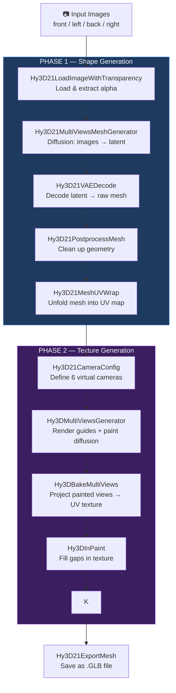
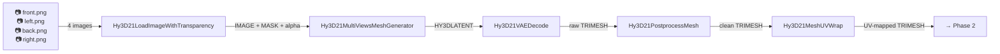
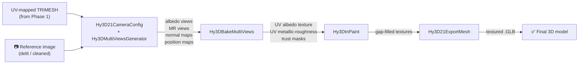
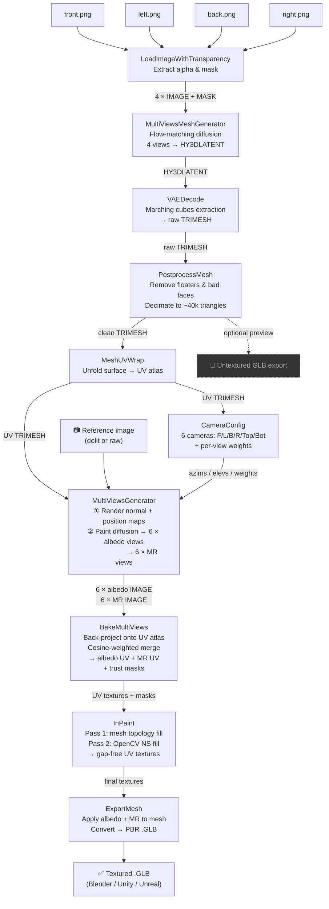

# Images to 3D Mesh — Full Pipeline

Hunyuan3D uses two completely separate AI models run one after the other: a **Shape model** that turns photos into geometry, and a **Paint model** that textures that geometry. ComfyUI wires them together as a graph of nodes.

---

## High-Level Overview

---

## Phase 1 — Shape Generation

This phase turns your photos into a clean, textureless 3D mesh.

### Node-by-Node Breakdown

#### `Hy3D21LoadImageWithTransparency`
Loads each image from disk and extracts the **alpha channel** (transparency). If the image has a background, this is where you also apply background removal. Passes three things downstream: the color image, the mask (silhouette), and the image-with-alpha combined.

> In plain terms: opens your photos and separates the object from the background.

---

#### `Hy3D21MultiViewsMeshGenerator` *(also seen as `Hy3DGenerateMeshMultiView` in v2.0 graphs)*
The core **shape diffusion model**. Takes all 4 views at once and runs a flow-matching diffusion process (similar to how Stable Diffusion generates images, but for 3D shapes). It does not produce a mesh directly — it produces a **latent**: a compressed mathematical description of the 3D form.

Key inputs you control:
| Parameter | What it does |
|---|---|
| `steps` | More steps = more refined shape, but slower (typically 50) |
| `guidance_scale` | How strictly it follows your images vs. improvising |
| `seed` | Locks the result so you can reproduce it |
| `attention_mode` | Performance setting (`sdpa` is the standard fast option) |

> In plain terms: an AI that studies all 4 photos and builds an internal 3D "idea" of the object.

---

#### `Hy3D21VAEDecode` *(also `Hy3DVAEDecode`)*
A learned **decoder** that converts the abstract latent into actual triangles. It scans through 3D space at a chosen resolution (like a medical CT scan slicing through an object) and finds the surface — a technique called **marching cubes**. The result is a TRIMESH: a collection of triangles forming the object's surface.

Key inputs you control:
| Parameter | What it does |
|---|---|
| `octree_resolution` | Detail level of the scan — 256 is standard, 384–512 gives finer detail but uses more VRAM |
| `box_v` | How large a bounding volume to scan (1.01 fits most objects) |
| `num_chunks` | Splits the scan into chunks to save memory |
| `mc_algo` | `mc` = standard marching cubes; `dmc` = dual variant, smoother but slower |

> In plain terms: converts the AI's "idea" into actual 3D geometry made of triangles.

---

#### `Hy3D21PostprocessMesh`
Cleans the raw mesh. Three optional fixes:
1. **Remove floaters** — deletes tiny disconnected blobs that float near the main object
2. **Remove degenerate faces** — removes broken triangles with zero area
3. **Reduce faces** — simplifies the mesh down to a maximum triangle count (e.g. 40,000) to keep it manageable

> In plain terms: tidies up the 3D model, removes junk, and simplifies it.

---

#### `Hy3D21MeshUVWrap`
**UV unwrapping** — takes the 3D mesh and creates a flat 2D map of its entire surface. Think of peeling an orange and pressing the skin flat. Every triangle on the mesh gets an address on this flat map. This map is called the **UV atlas** and is required before any texturing can happen.

> In plain terms: unfolds the 3D surface into a flat sheet so a texture image can be painted onto it.

---

## Phase 2 — Texture Generation

This phase paints the textureless mesh with realistic color and material properties.

### Node-by-Node Breakdown

#### `Hy3D21CameraConfig`
Defines the **virtual camera rig** — where to place cameras around the mesh for texture synthesis. The default is 6 cameras: front (0°), right (90°), back (180°), left (270°), top (90° elevation), and bottom (−90° elevation). Each camera is also given a **weight** — the front view is trusted most (weight 1.0), the top/bottom views least (weight 0.05–0.1).

> In plain terms: tells the system from which angles to "look" at the mesh when generating textures.

---

#### `Hy3DDelightImage` *(v2.0 graphs only)*
Before the paint step, this node **removes lighting and shadows** from the reference image. If your photo was taken under a lamp, this strips out the directional shadow so the texture captures only the object's true color. Without this, baked-in shadows would look wrong when you view the model from a different angle in a 3D scene.

> In plain terms: neutralizes the lighting in the reference photo so the texture is "shadow-free."

---

#### `Hy3DMultiViewsGenerator`
The main **texture AI node**. It does three things internally:

1. **Renders geometry guides** — takes the UV mesh and renders two maps from each camera angle:
   - *Normal map*: shows which direction every surface patch faces
   - *Position map*: shows the 3D world position of every visible surface point
2. **Runs the paint diffusion model** — feeds the reference image + normal maps + position maps into `HunyuanPaintPipeline`, which synthesizes a set of painted views of the mesh (all 6 angles at once, keeping them consistent with each other)
3. **Outputs two texture streams** — `albedo` (base color) and `mr` (metallic + roughness for PBR)

Key inputs you control:
| Parameter | What it does |
|---|---|
| `view_size` | Resolution of each synthesized view (e.g. 768px) |
| `steps` | Diffusion steps for texture quality (10 is fast draft, 25–50 is quality) |
| `guidance_scale` | How closely the texture follows the reference image |
| `texture_size` | Final UV texture resolution (e.g. 1024 or 2048px) |
| `unwrap_mesh` | Set to `false` if you already ran `Hy3D21MeshUVWrap` earlier |

> In plain terms: uses AI to paint realistic color and material maps around the entire mesh, guided by the geometry itself so every angle lines up correctly.

---

#### `Hy3DBakeMultiViews` *(also `Hy3DBakeFromMultiview`)*
**Baking** — takes the 6 painted views and projects them back onto the flat UV atlas. For each texel (UV pixel), it looks at which camera angles could see it and picks the best contribution using:
- **View weight** (from `Hy3DCameraConfig`) — trusts front-facing cameras more
- **Cosine weighting** (`cos^4`) — penalizes very oblique angles heavily

The result is a single UV texture image for albedo and another for metallic/roughness, plus **trust masks** that mark which UV areas were well-covered and which were hidden.

> In plain terms: merges all 6 painted views into one flat texture map, preferring views where the surface was seen head-on.

---

#### `Hy3DInPaint` *(combines `Hy3DMeshVerticeInpaintTexture` + `CV2InpaintTexture`)*
Fills the blank areas in the UV texture (spots no camera could see). Two repair passes happen in sequence:

**Pass 1 — Mesh-aware fill**
Uses the actual 3D topology — knowing which triangles are connected — to spread color from nearby visible surfaces into the hidden ones. This is smarter than plain image fill because it respects the shape of the object.

**Pass 2 — Image fill (Navier-Stokes)**
A standard 2D image-completion algorithm (similar to Photoshop content-aware fill) patches whatever small holes remain in the flat texture image.

Both passes run independently for albedo and metallic/roughness, so you get 4 repair passes in total.

> In plain terms: fills in the "blind spots" in the texture — the parts of the object that no camera angle could see.

---

#### `Hy3D21ExportMesh`
Assembles the final file. Applies the repaired albedo and metallic/roughness textures to the mesh, then saves everything as a **GLB file** — an industry-standard 3D format that bundles geometry, UV layout, and PBR textures into one self-contained file. GLB can be opened directly in Blender, Unity, Unreal Engine, three.js, or any modern 3D viewer.

> In plain terms: packages the finished 3D model with all its textures into a single file you can use anywhere.

---

## Complete Data Flow

---

## Artifact Formats Moving Through the Pipeline

| Format | What it is |
|---|---|
| `IMAGE` | A batch of photos as a float tensor `[batch, height, width, channels]` |
| `MASK` | A single-channel silhouette image |
| `HY3DLATENT` | Compressed internal 3D representation from the shape diffusion model |
| `HY3DVAE` | The loaded VAE decoder model handle |
| `TRIMESH` | A 3D mesh object (vertices + triangles), can carry UV coordinates |
| `HY3DCAMERA` / `HY3D21CAMERA` | Camera config object (angles, weights, scale) |
| `HY3DPIPELINE` | Loaded paint pipeline handle, also carries the renderer state |
| `NPARRAY` | UV texture + trust mask (stored as tensors despite the label) |
| `.GLB` | Final output file — geometry + UV + PBR textures in one file |

---

## Quick Reference: What Breaks Where

| If this is wrong... | This phase breaks |
|---|---|
| Photos not aligned (front is actually ¾ view) | Shape generation — lopsided or duplicate geometry |
| Background not removed cleanly | Shape generation — mesh includes background fragments |
| UV unwrap runs twice | Texture baking — UVs mismatch, textures misaligned |
| Camera config angles outside training range | Paint diffusion — texture inconsistencies across views |
| Large occluded areas (e.g. hollow object) | Baking — large blank regions in UV, heavy inpainting artifacts |
| Delighting too aggressive | Texture — washed-out colors, lost surface detail |
